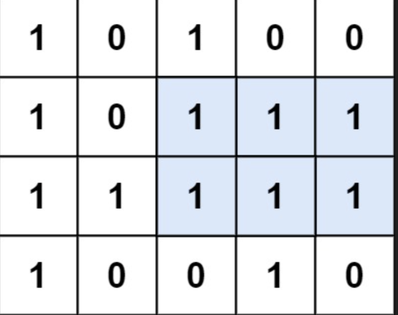
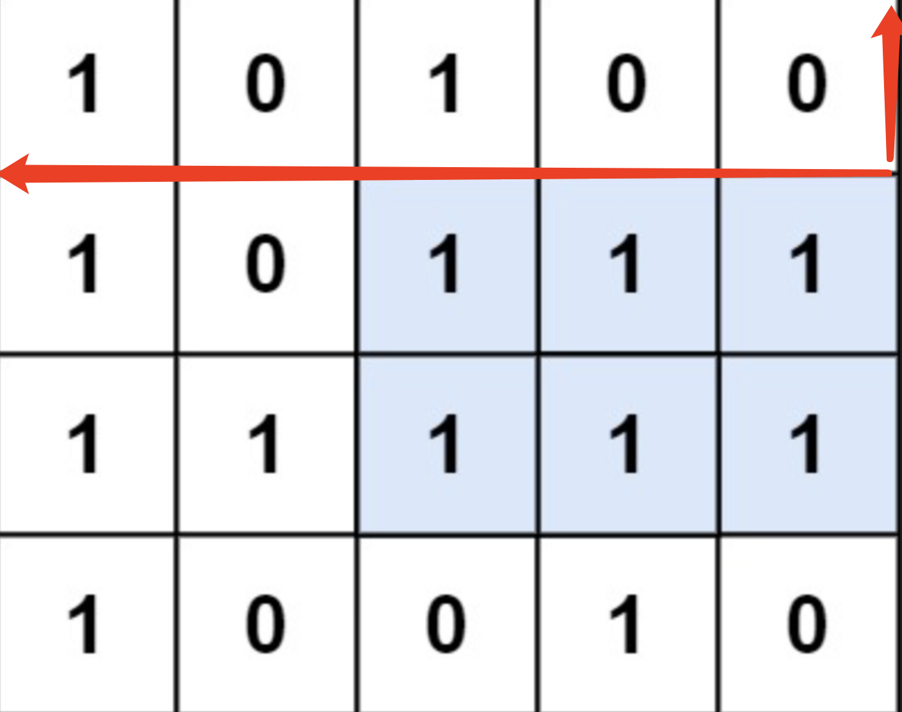
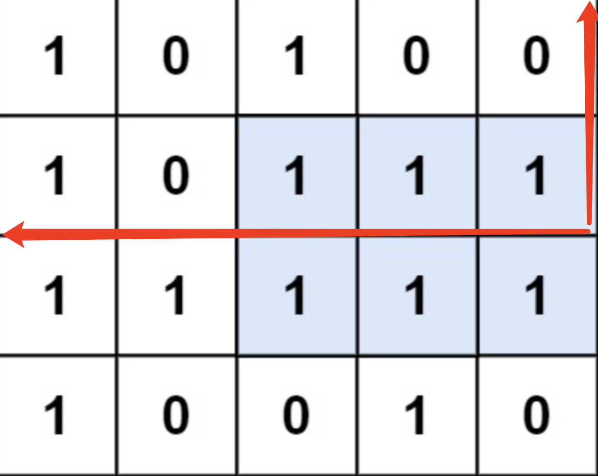
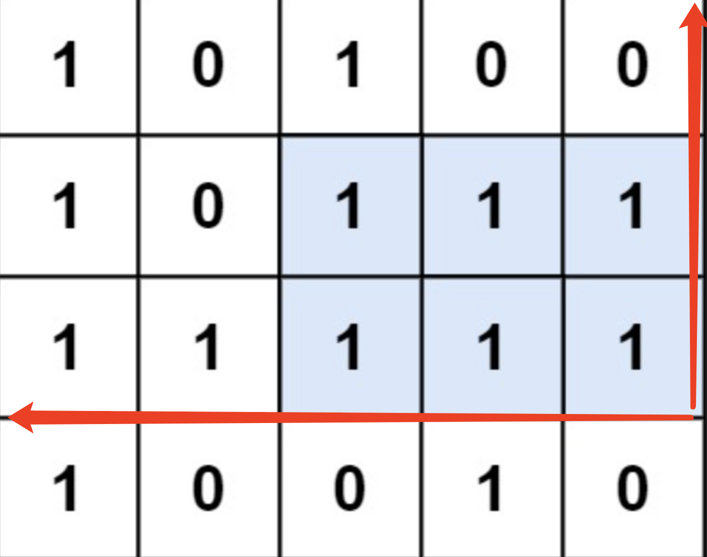
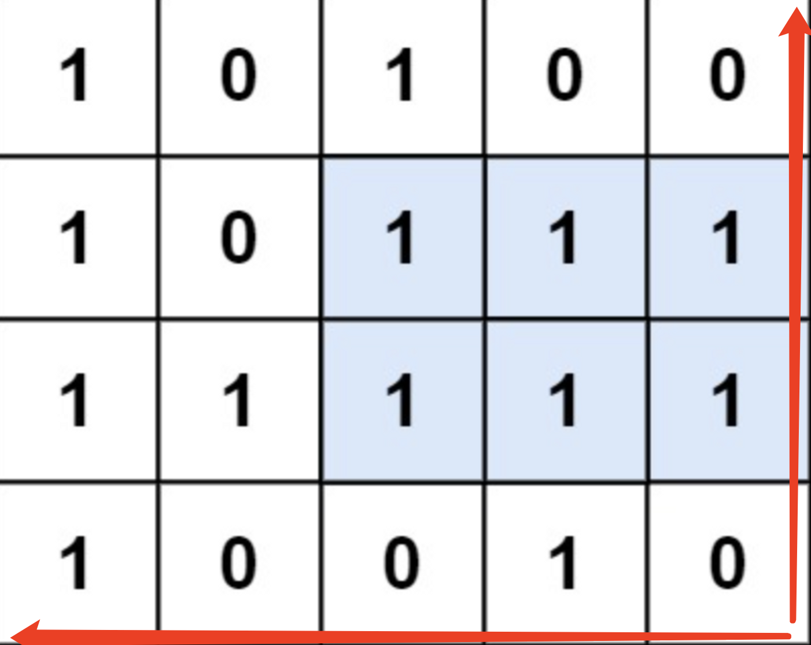

# 最大矩形

题目链接：[最大矩形](https://leetcode.cn/problems/maximal-rectangle/description/)

这一道题主要难在思路比较难想，一旦想明白了思路就会发现这道题其实并没有很复杂，这道题目需要计算为1的元素组成的最大矩形面积，我们第一步就是需要把这个矩阵转换为数组，然后就能使用我们很熟悉的单调栈的解题思想去解这道题了，所以问题的关键是如何将这道题的矩阵转换为我们熟悉的数组，这里说明一下思路，就拿这道题的案例来举例子，先来看一下计算过程



我们可以将矩阵中的一行一行压入一个数组，然后去计算这个数组中的最大矩形面积，就可以把问题转换为柱状图中的最大矩形这道题目，先看第一行：



如图，我们只看第一行，此时我们创建一个数组为[1,0,1,0,0]，数组的值就等于第一行，然后我们计算这个数组中的最大矩形面积为1，然后再看前两行：



这个时候我们需要把第二行的数据压入我们之前创建的数组，这个数组为[2,0,2,1,1]，其实这个时候我们看加上坐标轴之后我们就应该明白这道图如何转换为柱状图中的最大矩形了，计算最大矩形面积为3，然后再看第三行：



同上，此时数组为[3，1，3，2，2]，计算最大矩形面积为6，最后看第四行：



此时第四行压入数组，要注意，此时很多位的值都是0，为0的话需要重置当前位的数字，此时数组为[4,0,0,3,0]，计算最大矩形面积为4，最后比较得出，最大面积为6。这道题的难点就在于问题的转换，只要明白了转换问题我们会发现这道题我们需要做的就是依次将每行压入数组。

```js
/**
 * @param {character[][]} matrix
 * @return {number}
 */
var maximalRectangle = function (matrix) {
  if (matrix.length === 0) return 0;
  if (matrix[0].length === 0) return 0;

  let heights = new Array(matrix[0].length).fill(0);
  let maxArea = 0;

  for (let i = 0; i < matrix.length; i++) {
		// 遍历每一行，并把当前行压入数组
    heights = heights.map((h, index) => {
      if (Number(matrix[i][index]) === 0) {
        return 0;
      }
      return h + 1;
    });
		
    maxArea = Math.max(maxArea, largestRectangleArea(heights));
  }

  return maxArea;
};

/**
 * 柱状图中的最大矩形
 * @param {number[]} heights
 * @return {number}
 */
var largestRectangleArea = function (heights) {
  let left = new Array(heights.length).fill(-1);
  let right = new Array(heights.length).fill(heights.length);
  let stack = [];
  let maxArea = 0;

  for (let i = 0; i < heights.length; i++) {
    while (stack.length > 0 && heights[stack[stack.length - 1]] > heights[i]) {
      right[stack.pop()] = i;
    }
    stack.push(i);
  }

  stack.length = 0;

  for (let i = heights.length - 1; i >= 0; i--) {
    while (stack.length > 0 && heights[stack[stack.length - 1]] > heights[i]) {
      const index = stack.pop();
      left[index] = i;
    }
    stack.push(i);
  }

  for (let i = 0; i < heights.length; i++) {
    const width = right[i] - left[i] - 1;
    const height = heights[i];
    const area = width * height;
    maxArea = Math.max(maxArea, area);
  }

  return maxArea;
};
```