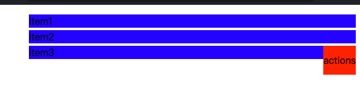
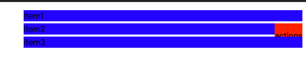

<!--
 * @Description: 头部注释
-->
# zIndex理解

最近开始参与了公司的组件库工作，刚开始就是帮忙负责修复一些历史遗留的issue，在最近修复的issue的时候遇见了一个非常有意思的css问题，现象是这样的，一个列表，列表的每一项最后都有一个按钮，这个按钮是一个dropdown button，也就是可以下拉的，但是呢它的下拉悬浮层却被列表的后一项给覆盖住了，可以查看这个[在线demo](https://stackblitz.com/edit/stackblitz-starters-hqnr7oa7?file=styles.css)。

如下图，hover的时候后面的悬浮层会被列表的下一项给覆盖住，并且无论把 `z-index` 调大还是调小，结果都不起作用。




最初我就以为是这个悬浮层的z-index设置的不够大，调整一下z-index就可以了，于是我尝试性的在浏览器里将悬浮层的z-index调整为了10000，发现完全没有生效，于是我眉头一皱，发现事情并不简单。所以在背后就去深入的了解了一下z-index属性的作用到底是怎么回事。

要搞清楚z-index属性首先要理解一个名词，这个叫做“层叠上下文”，默认情况下我们在页面上写的元素是按照正常文档流布局的，也就是从上到下，从左到右，但是遇见一些情况下会生成一些层叠上下文，所谓的层叠上下文就可以理解为浏览器上的z轴，下面的层叠上下文中的元素不管 `z-index` 设置的多大，都会被其上面的层叠上下文元素所覆盖起来。

可以通过 `z-index` 来控制层叠上下文的元素的层级关系，但是无论其 `z-index` 设置的值为多大，都无法脱离其父层叠上下文，比如下面这个例子

```html
<style>
    .box {
        position: relative;
        z-index: 1;
    }
    
    .box2 {
        position: relative;
        z-index: 2;
    }
    
    .box .item {
        position: absolute;
        z-index: 100;
    }
</style>

<div class="box">
    <div class="item"></div>
</div>
<div class="box2"></div>
```

这个例子中不管 `item` 元素的 `z-index` 是多少，它都会被 `box2` 覆盖掉，因为 `item` 元素是在 `box` 元素所创建的层叠上下文上的，而 `box` 的层叠上下文的高度不如 `box2` 的层叠上下文的高度，所以 `item` 元素被 `box2` 覆盖掉了。