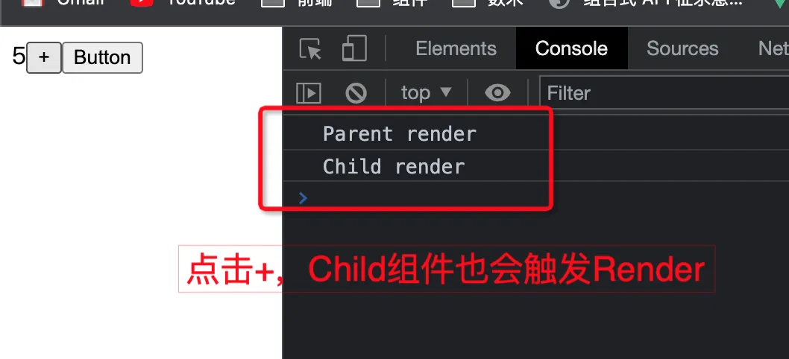
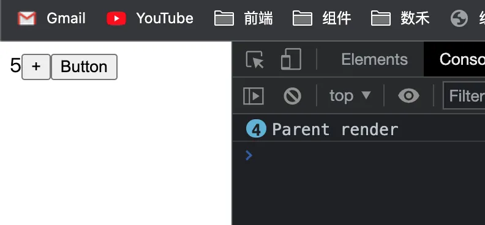
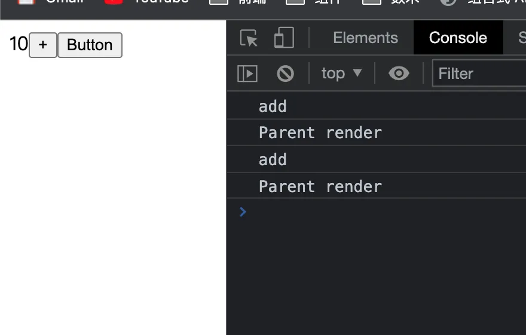

> <font style="color:rgb(69, 77, 100);">持久化 function 的 Hook，理论上，可以使用 useMemoizedFn 完全代替 useCallback。</font>
>

<font style="color:rgb(69, 77, 100);">官方文档地址：</font>[useMemoizedFn](https://ahooks.js.org/zh-CN/hooks/use-memoized-fn)

react中提供了一些用来优化的hooks，比如useCallback，useMemo，而我们在使用这些hooks的时候有时不免会存在漏写依赖项的情况从而引发一些问题，比如无法在函数中获取状态的最新值等，而针对这种场景ahooks中实现了useMemoizedFn。

## 场景
首先我们先了解一下这个hooks解决的问题场景，我们在很多情况下都会往子组件中传入一个方法，比如：

```jsx
function ParentComponent () {
  console.log('Parent render')
  const [count, setCount] = useState(1)

  const onClick = () => {
    alert('hello')
  }
  
  return (
    <div>
      { count }
      <button onClick={() => setCount(x => x + 1)}>+</button>
      <Child 
        onClick={onClick}
      />
    </div>
  )
}

const Child = memo(({ onClick }) => {
  console.log('Child render')
  return (
    <button onClick={onClick}>{'Button'}</button>
  )
})
```



注意我们的Child组件使用了优化性能的高阶[memo](https://zh-hans.reactjs.org/docs/react-api.html#reactmemo)，这个时候如果我们在页面上点击“加号”按钮，然后去看控制台会发现Child组件也进行了render，但是我们的Child组件中根本没有使用count这个状态，所以这种render是没有必要的。

想要解决这种不必要的render，首先需要明白这种render是怎么触发的， **而在React中所有的组件重新render要么是自身的props中有属性发生改变，或者自身的内部状态发生改变。** 而Child组件中并没有自身状态，所以必然是props发生了变化，然后我们去看props，props中只存在一个属性onClick，这时候我们就会发现只要我们的PrarentComponent组件进行render，那么onClick方法就会重新被声明，而这时候Child组件会认为onClick方法发生了变化，所以进行了一次render。

既然我们知道了问题所在，那么就有了解决问题的思路，既然onClick方法每次都会被重新声明，那么我如果保证这个方法在新声明之后和之前的内存地址一致不就可以解决这种无意义的render了吗？useCallback就是起到了这么一个作用，我们把上面的代码做一下修改然后再试一下。

```jsx
const onClick = useCallback(() => {
  alert('hello')
}, [])
```



我们发现这个时候就只有ParentComponent进行了render，Child组件就不会跟着render了，然而useCallback并不是特别的好用，因为我们需要在第二个参数中输入依赖项，而有时候我们如果漏掉了某些依赖项，就会无法在方法中获取到最新的状态，比如：

```jsx
function Demo() {
  const [count, setCount] = useState(1)
  
  const add = useCallback(() => {
    console.log('add')
    setCount(count + 1)
  }, [])
  
  return (
    <div>
      { count }
      <button onClick={add}>+</button>
    </div>
  )
}
```



这种场景是因为我们的add方法中依赖了count状态，但是我们又没有将count状态放进useCallback的依赖项里，所以引发了这样的问题，解决的办法是将count放在useCallback的第二个参数里面，但是每次都写依赖项的话会增加我们的心智负担，特别是某个方法使用的状态特别多的情况下。

所以ahooks中就提供了useMemoizedFn，它没有第二个参数，并且始终都可以获取到最新的状态。

## 实现
useMemoizedFn的实现同样是利用了useRef的特性去实现的。总结起来useMemoizedFn的核心功能有两点：

1. 保证方法的内存地址始终不变
2. 始终能获取到最新的状态

然后我们来看一下在源码中ahooks是如何实现这两点的

```tsx
function useMemoizedFn<T extends noop>(fn: T) {
  if (process.env.NODE_ENV === 'development') {
    if (!isFunction(fn)) {
      console.error(`useMemoizedFn expected parameter is a function, got ${typeof fn}`);
    }
  }

  const fnRef = useRef<T>(fn);

  // why not write `fnRef.current = fn`?
  // https://github.com/alibaba/hooks/issues/728
  fnRef.current = useMemo(() => fn, [fn]);

  const memoizedFn = useRef<PickFunction<T>>();
  if (!memoizedFn.current) {
    memoizedFn.current = function (this, ...args) {
      return fnRef.current.apply(this, args);
    };
  }

  return memoizedFn.current as T;
}
```

源码中的逻辑也很简单，核心逻辑只有下面这一点

```tsx
// 通过useRef保证引用地址不变，并且始终能够获取最新的状态
const fnRef = useRef<T>(fn);
fnRef.current = useMemo(() => fn, [fn]);

// 通过useRef保证引用地址不变，并且始终能够获取最新的状态
const memoizedFn = useRef<PickFunction<T>>();
if (!memoizedFn.current) {
  // 仅在第一次渲染的时候执行，储存持久化函数，调用此方法会执行原函数
  memoizedFn.current = function (this, ...args) {
    return fnRef.current.apply(this, args);
  };
}
```

这个实现方式让我想到了单例模式，因为memoizedFn一旦存在值就不会被重新创建了，所以就保证了内存地址的唯一，而我们每次update的时候传入的fn都是一个新的方法，使用useMemo去缓存的时候依赖项只有自身，所以在每次update的时候fnRef.current都会被重新赋值，这样就保证了始终能够获取到最新的状态，ahooks中使用了非常巧妙的引用类型引用关系去实现了这两个功能。

然后我们把上面案例中的useCallback替换成useMemoizedFn来看一下


效果是一样的，Child组件不会render，并且始终都可以获取到最新的状态值。

