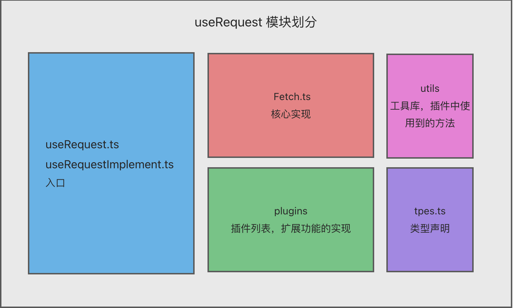
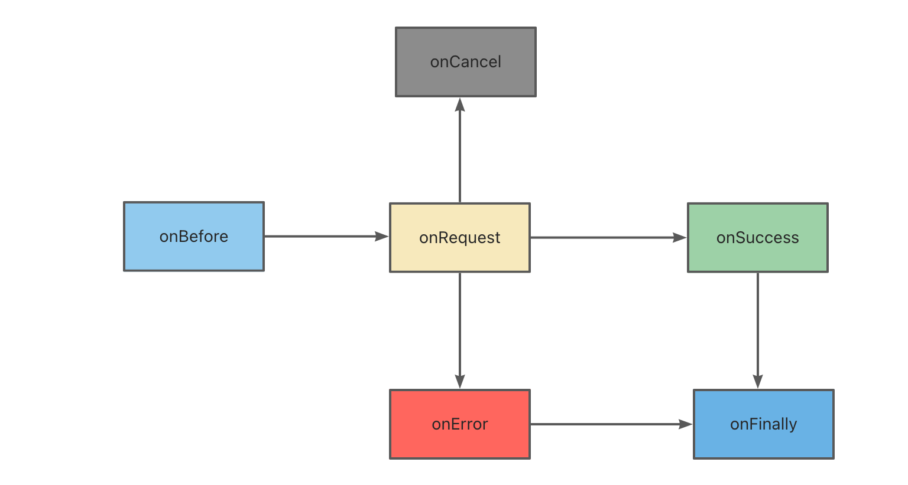
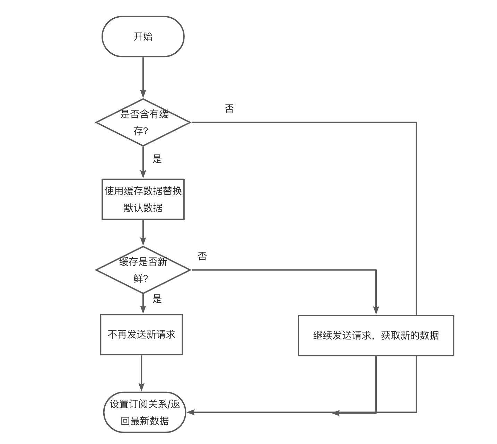

> <font style="color:rgb(213, 97, 97);background-color:rgb(246, 247, 249);">useRequest</font><font style="color:rgb(69, 77, 100);"> 是一个强大的异步数据管理的 Hooks，React 项目中的网络请求场景使用 </font><font style="color:rgb(213, 97, 97);background-color:rgb(246, 247, 249);">useRequest</font><font style="color:rgb(69, 77, 100);"> 就够了。</font>
>

官方文档：[useRequest](https://ahooks.js.org/zh-CN/hooks/use-request/index)

## 场景
在我们开发业务的时候经常会处理请求，比如初始化表格、初始化下拉框的选项等场景，一般这种情况我们可能会自己去封装一个自定义`hooks`，比如说我们要在页面`mount`后获取一个下拉框的数据，我们可以这样写

```tsx
function useSelectOptions() {
  const [options, setOptions] = useState([])
  
  useEffect(() => {
    fetch('xxx')
    .then(res => res.json())
    .then(res => {
      setOptions(res?.data || [])
    })
  }, [])
  
  return {
    data: options
  }
}

function Page () {
  const { data } = useSelectOptions()
  
  // ......
}
```

有些情况下我们可能还需要手动进行调用，比如说获取表格数据的请求，除了在页面`mount`需要调用之外我们在进行搜索动作的时候同样需要调用，这种情况下我们一般会再暴露出一个发送请求的方法，如下：

```typescript
function useTableData() {
  const [data, setData] = useState([])
  
  useEffect(() => {
    run()
  }, [])

  const run = useCallback((params) => {
    fetch('xxx')
    .then(res => res.json())
    .then(res => {
      setData(res?.data || [])
    })
  }, [])
  
  return {
    data,
    run,
  }
}

function Page () {
  const { data, run } = useTableData()

  // ...
}
```

如果需要`loading`的话我们会去添加`loading`的状态等等，然而实际的开发中我们遇到的场景可能比这个demo复杂的多，而为了应对这一类请求的场景，`ahooks`里面帮助我们实现了`useRequest`这个`hooks`，专门用来处理请求这种场景，可以让我们更方便的管理我们的请求。

## 源码
这个`hooks`的源码相较而言比较多，所以我们先来看一下目录结构

```plain
|- useRequest
  |- __test__
  |- doc
  |- src
    |- plugins 
    |- utils 
    |- Fetch.ts
    |- types.ts
    |- useRequest.ts
    |- useRequestImplement.ts
  |- index.ts
```

### useRequest.ts
首先我们要从入口文件开始看起

```typescript
function useRequest<TData, TParams extends any[]>(
  service: Service<TData, TParams>,
  options?: Options<TData, TParams>,
  plugins?: Plugin<TData, TParams>[],
) {
  return useRequestImplement<TData, TParams>(service, options, [
    ...(plugins || []),
    useDebouncePlugin,
    useLoadingDelayPlugin,
    usePollingPlugin,
    useRefreshOnWindowFocusPlugin,
    useThrottlePlugin,
    useAutoRunPlugin,
    useCachePlugin,
    useRetryPlugin,
  ] as Plugin<TData, TParams>[]);
}
```

首先我们可以看到在主文件中最终返回的`useRequestImplement`，所以我们接下来要去看`useRequestImplement`，要注意这里的`useRequest`是有第三个参数的，不过官网上并没有提及，从参数上可以看出这个参数是插件，这也就意味着我们可以通过插件来扩展`useRequest`的功能。

### useRequestImplement.ts
然后我们打开`useRequestImplement.ts`

```typescript
function useRequestImplement<TData, TParams extends any[]>(
  service: Service<TData, TParams>,
  options: Options<TData, TParams> = {},
  plugins: Plugin<TData, TParams>[] = [],
) {
   ....
    
  return {
    loading: fetchInstance.state.loading,
    data: fetchInstance.state.data,
    error: fetchInstance.state.error,
    params: fetchInstance.state.params || [],
    cancel: useMemoizedFn(fetchInstance.cancel.bind(fetchInstance)),
    refresh: useMemoizedFn(fetchInstance.refresh.bind(fetchInstance)),
    refreshAsync: useMemoizedFn(fetchInstance.refreshAsync.bind(fetchInstance)),
    run: useMemoizedFn(fetchInstance.run.bind(fetchInstance)),
    runAsync: useMemoizedFn(fetchInstance.runAsync.bind(fetchInstance)),
    mutate: useMemoizedFn(fetchInstance.mutate.bind(fetchInstance)),
  } as Result<TData, TParams>;
}
```

我们先看一下这个`hooks`入参和`useRequest`是一样的，并且`useRequest`最终吐出的所有`api`都来自这里，然后我们仔细看一下会发现，所有的api都在`fetchInstance`这个实例上，所以这里源码的关键问题就在于`fetchInstance`这个实例对象是如何被创建的，然后我们去看一下`fetchInstance`被创建的过程

```typescript
function useRequestImplement<TData, TParams extends any[]>(
  service: Service<TData, TParams>,
  options: Options<TData, TParams> = {},
  plugins: Plugin<TData, TParams>[] = [],
) {
  const { manual = false, ...rest } = options;

  const fetchOptions = {
    manual,
    ...rest,
  };

  const serviceRef = useLatest(service);

  const update = useUpdate();

  const fetchInstance = useCreation(() => {
    // 执行插件的onInit方法，并将执行结果合并作为实例第四个参数
    const initState = plugins.map((p) => p?.onInit?.(fetchOptions)).filter(Boolean);

    return new Fetch<TData, TParams>(
      serviceRef,
      fetchOptions,
      update,
      Object.assign({}, ...initState),
    );
  }, []);
  fetchInstance.options = fetchOptions;
  // run all plugins hooks
  // 储存所有插件执行结果的数组
  fetchInstance.pluginImpls = plugins.map((p) => p(fetchInstance, fetchOptions));  
  
  ...  
}
```

从这一部分源码中我们可以看出`fetchInstance`其实是使用`Fetch`构造函数创建了一个实例，而创建实例传入了四个参数，然后我们逐一看一下这些参数分别是什么：

| 序号 | Fetch实参 |
| --- | --- |
| 1 | 使用useLatest获取到的最新的请求函数 |
| 2 | 请求配置项 |
| 3 | useUpdate返回的刷新组件的方法 |
| 4 | 插件中需要使用的初始化状态 |


这里我们详细看一下第四个参数，看第四个参数就需要详细看一下这一行代码

```typescript
const initState = plugins.map((p) => p?.onInit?.(fetchOptions)).filter(Boolean);
```

我们从`useRequest.ts`源码中可以知道plugins是一个数组，然后我们看这里会遍历数组执行每个插件的`onInit`方法，但是我们需要注意这里的写法使用了`?.`并且后面使用了`filter`过滤，这一点说明并不是所有的插件都需要`onInit`方法，而第四个参数就是所有插件的`onInit`方法的返回结果合并后的一个对象，这里我们也就猜测到了一点，插件如果有`onInit`方法那么此方法都需要返回一个对象。

然后我们还需要注意这一行代码

```typescript
fetchInstance.pluginImpls = plugins.map((p) => p(fetchInstance, fetchOptions));  
```

从这一行我们可以看出来`fetchInstance.pluginImpls`上储存的是所有插件执行结果所组成的一个数组，也就是在这一步我们可以看出每一个插件都是一个函数，每个插件接受两个参数，一个是请求实例`fetchInstance`另一个是请求配置`fetchOptions`，我们现在只需要记住这些信息，暂时先不关注这些插件执行后返回了什么，然后我们接着往下看`useRequestImplement.ts`的最后一部分代码：

```typescript
function useRequestImplement<TData, TParams extends any[]>(
  service: Service<TData, TParams>,
  options: Options<TData, TParams> = {},
  plugins: Plugin<TData, TParams>[] = [],
) {
  ...
   
  useMount(() => {
    // manual 为false时，mount的时候自定触发一次请求
    if (!manual) {
      // useCachePlugin can set fetchInstance.state.params from cache when init
      const params = fetchInstance.state.params || options.defaultParams || [];
      // @ts-ignore
      fetchInstance.run(...params);
    }
  });

  useUnmount(() => {
    // 组件卸载阶段取消请求
    fetchInstance.cancel();
  });
  
  ...
}
```

这里我们可以看出在组件挂载的时候如果我们的配置中`manual`为`false`时会自动执行一次`run`方法，这样就达到了默认调用的功能，然后在组件卸载的时候会调用`cancel`方法来<font style="color:rgb(69, 77, 100);">取消当前正在进行的请求，到这里</font>`useRequestImplement.ts`的源码我们就也看完了，然后我们去看一下这个`Fetch`类内部到底是如何实现这些`api`的。

### Fetch.ts
```typescript
export default class Fetch<TData, TParams extends any[]> {
  ...
}
```

#### 属性
我们打开`Fetch.ts`文件来看`Fetch`是一个类，然后我们先来看一下它的属性：

```typescript
pluginImpls: PluginReturn<TData, TParams>[]; // 插件执行结果组成的数组

count: number = 0; // 请求的次数

state: FetchState<TData, TParams> = { // 最终暴露的状态API
  loading: false,
  params: undefined,
  data: undefined,
  error: undefined,
};
```

我们看到这里就知道了，我们在使用这个`hooks`的时候所用到的状态`api`都在`state`这个属性上面，但是在看到这里的时候我们要思考一个问题，那就是`Fetch`这个类并没有继承`React.Component`，它只是一个普通的类，那么它是如何达到和`useState`一样的效果的呢？（在第一次看`useRequestImplement.ts`的时候我以为`state`是使用`useReducer`声明的），然后我们去看一下`Fetch`类的`constructor`方法

#### 构造器
```typescript
constructor(
  public serviceRef: MutableRefObject<Service<TData, TParams>>,
  public options: Options<TData, TParams>,
  public subscribe: Subscribe,
  public initState: Partial<FetchState<TData, TParams>> = {},
) {
  this.state = {
    ...this.state,
    loading: !options.manual,
    ...initState, // 将插件中需要进行初始化的状态初始化
  };
}
```

在构造方法里这里只是将所有插件的`onInit`事件中返回的状态放入了`state`内部，然后我们看一下`Fetch`类中包含的方法有那些

#### setState
```typescript
setState(s: Partial<FetchState<TData, TParams>> = {}) {
  this.state = {
    ...this.state,
    ...s,
  };
  this.subscribe(); // 为useUpdate提供的方法，用于刷新视图，刷新后获取到最新的类状态
}
```

我们可以看到，这个方法的作用是用来修改state中的状态的值，之后会调用`subscribe`方法，然后我们看一下这个`subscribe`方法到底是什么，我们可以看出，这个方法是构造方法里的第三个参数，然后我们回过头想一下创建`Fetch`时第三个参数传入的是什么：

| 序号 | Fetch实参 |
| --- | --- |
| 1 | 使用useLatest获取到的最新的请求函数 |
| 2 | 请求配置项 |
| 3 | useUpdate返回的刷新组件的方法 |
| 4 | 插件中需要使用的初始化状态 |


到这里我们就明白了`useRequest`中是如何让普通的类属性达到和`React`状态一样的效果了：

1. 首先`setState`会修改`state`中的属性值
2. 在修改值之后会调用`useUpdate`方法返回的更新组件的方法触发组件`render`
3. 组件重新`render`之后会重新从`state`中取到对应的属性，而这时这些属性已经是更新后的值了

#### runPluginHandler
```typescript
runPluginHandler(event: keyof PluginReturn<TData, TParams>, ...rest: any[]) {
  // @ts-ignore
  // 执行所有插件返回值中对应的生命周期函数，并将结果整合后返回
  const r = this.pluginImpls.map((i) => i[event]?.(...rest)).filter(Boolean);
  return Object.assign({}, ...r);
}
```

首先我们看一下这个方法的名字，我们知道这个方法是和插件相关的方法，然后我们看一下它的入参：

1. 第一个入参`event`是`PluginReturn`这个类型中的`key`
2. 第二个入参`rest`是一些参数

然后我们看一下它的内部干了什么，首先通过前面的源码我们可以知道`pluginImpls`是一个由所有插件的执行结果所组成的数组，而这里很明显是执行了每个插件返回结果的`[event]`方法，并且把`rest`作为了该方法的入参，最终将所有插件的`[event]`方法的返回结果组合再返回，然后我们需要看一下`PluginReturn`这个类型，看一下这个`event`都能是什么东西：

```typescript
export interface PluginReturn<TData, TParams extends any[]> {
  onBefore?: (params: TParams) =>
    | ({
        stopNow?: boolean;
        returnNow?: boolean;
      } & Partial<FetchState<TData, TParams>>)
    | void;

  onRequest?: (
    service: Service<TData, TParams>,
    params: TParams,
  ) => {
    servicePromise?: Promise<TData>;
  };

  onSuccess?: (data: TData, params: TParams) => void;
  onError?: (e: Error, params: TParams) => void;
  onFinally?: (params: TParams, data?: TData, e?: Error) => void;
  onCancel?: () => void;
  onMutate?: (data: TData) => void;
}
```

这里我们就明白了`event`参数可以是`onBefore`、`onRequest`、`onSuccess`、`onError`、`onFinally`、`onCancel`、`onMutate`这七个值，而每个`useRequest`插件也需要返回一个包含这些属性中某几个的一个对象，这些方法会在`useRequest`的特定生命周期中执行。

#### runAsync
之后剩下的方法就都是我们使用的`api`了，我们需要好好看一下内部的实现，首先我们看一下使用最多的`runAsync`

```typescript
async runAsync(...params: TParams): Promise<TData> {
  this.count += 1;
  const currentCount = this.count;

	// 执行所有插件的onBefore生命周期，并从执行结果中获取stopNow，returnNow配置
  const {
    stopNow = false,
    returnNow = false,
    ...state
  } = this.runPluginHandler('onBefore', params);

  // stop request
	// 如果stopNow，直接取消请求
  if (stopNow) {
    return new Promise(() => {});
  }

  this.setState({
    loading: true,
    params,
    ...state,
  });

  // return now
  if (returnNow) {
    // 如果returnNow为true直接将之前最后一次请求的结果返回，缓存功能
    return Promise.resolve(state.data);
  }

  this.options.onBefore?.(params);

  try {
    // replace service
    // 如果启用了缓存策略，这里可能会返回缓存后的Promise
    let { servicePromise } = this.runPluginHandler('onRequest', this.serviceRef.current, params);

    if (!servicePromise) {
      servicePromise = this.serviceRef.current(...params);
    }

    const res = await servicePromise;

    // currentCount 与 this.count相等表示是最新的一次请求
    if (currentCount !== this.count) {
      // prevent run.then when request is canceled
      return new Promise(() => {});
    }

    // const formattedResult = this.options.formatResultRef.current ? this.options.formatResultRef.current(res) : res;

    this.setState({
      data: res,
      error: undefined,
      loading: false,
    });

    // 请求成功执行onSuccess以及onFinally
    this.options.onSuccess?.(res, params);
    this.runPluginHandler('onSuccess', res, params);

    this.options.onFinally?.(params, res, undefined);

    if (currentCount === this.count) {
      this.runPluginHandler('onFinally', params, res, undefined);
    }

    return res;
  } catch (error) {
    // 请求异常处理，执行onError以及onFinally
    if (currentCount !== this.count) {
      // prevent run.then when request is canceled
      return new Promise(() => {});
    }

    this.setState({
      error,
      loading: false,
    });

    this.options.onError?.(error, params);
    this.runPluginHandler('onError', error, params);

    this.options.onFinally?.(params, undefined, error);

    if (currentCount === this.count) {
      this.runPluginHandler('onFinally', params, undefined, error);
    }

    throw error;
  }
}
```

1. 这个方法会记录当前是储存的第几次请求，然后会执行所有插件结果中的`onBefore`方法，然后会从插件的执行结果之中获取到`stopNow`、`returnNow`两个属性，如果`stopNow`为`true`的情况下会直接返回一个`Promise`中断本次请求，然后会把插件中`onBefore`生命周期返回的状态以及本次请求的参数放入`state`，如果`returnNow`为`true`不会发送请求，直接会将现在的`state`中的`data`作为`Promise`的结果返回，猜测一下这里应该是缓存相关的插件配置项，当符合缓存的条件，`returnNow`就会设置为`true`这时会返回上一次请求的`data`结果。
2. 执行`useRequest`的`onBefore`生命周期。
3. 然后就是发送请求的过程了，首先会执行插件的`onRequest`生命周期，这个生命周期会返回我们的请求`Promise`，如果这个`Promise`不存在的话，会将我们传入的请求方法的执行结果作为请求`Promise`，等等请求`Promise`返回结果之后，会做一下判断，如果本次请求不是最新的一次请求的话会返回空的`Promise`中断请求，否则的话会将请求结果存入`state`，然后执行自身的`onSuccess`以及插件的`onSuccess`生命周期，之后执行`onFinally`以及插件的`onFinally`生命周期，这里注意插件的`onFinally`执行之前又判断是一次是是否是最新的请求，明明上面已经判断过一次了，这里为什么还要再判断一次呢？这是因为我们是可以在插件生命周期中修改`count`的，而上面执行了插件的`onSuccess`所以这里需要重新判断一下。
4. 最后是请求异常的情况，如果存在异常的话，首先如果不是最新的请求直接中断请求，否则将错误信息放入state，执行`onError`以及插件的`onError`生命周期，最后是`onFinally`以及插件的`onFinally`生命周期

从`runAsync`方法的源码中我们可以更清除的知道`useRequest`的生命周期函数的执行时机，以及插件的各个生命周期的执行时机，而`useRequest`最核心的部分也都在这个`api`的代码中了。

#### run
```typescript
run(...params: TParams) {
  // 直接执行了runAsync，并处理了异常情况，所以使用了run的情况下，只能使用onError处理异常
  this.runAsync(...params).catch((error) => {
    if (!this.options.onError) {
      console.error(error);
    }
  });
}
```

`run`是`runAsync`的同步版本，它内部只是执行了一次`runAsync`，如果我们没有配置`onError`生命周期的话，会给我们打印一条错误日志。

#### cancel
```typescript
cancel() {
  // 看过runAsync的实现后明白，修改了count之后，runAsync中比较不是请求编号和count不相等会返回空promise取消请求
  this.count += 1;
  this.setState({
    loading: false,
  });

  this.runPluginHandler('onCancel');
}
```

`cancel`用来取消当前正在发送的请求，实现方式非常简单，将`count`加1就可以，然后执行插件的`onCancel`生命周期，我们从`runAsync`的源码中是可以看出，如果`count`增加后，`runAsync`中会判定不是最新的请求，就会直接返回一个空的`Promise`，从而达到中断请求的目的。

#### refresh
```typescript
refresh() {
  // @ts-ignore
  // 使用最近得到一次参数重新调用run
  this.run(...(this.state.params || []));
}
```

`refresh`会使用最近的一次参数重新发起一次请求，而在`runAsync`中每次都会把最新的参数使用`state.params`储存起来，所以它的实现就非常简单，直接将`state.params`作为参数执行`run`方法即可。

#### refreshAsync
```typescript
refreshAsync() {
  // @ts-ignore
  // 使用最后一次参数调用runAsync
  return this.runAsync(...(this.state.params || []));
}
```

`refreshAsync`方法是`refresh`的异步版本，所以这里执行的是`runAsync`，实现方式完全一致。

#### mutate
```typescript
mutate(data?: TData | ((oldData?: TData) => TData | undefined)) {
  // 手动修改state.data，并执行onMutate生命周期
  let targetData: TData | undefined;
  if (isFunction(data)) {
    // @ts-ignore
    targetData = data(this.state.data);
  } else {
    targetData = data;
  }

  this.runPluginHandler('onMutate', targetData);

  this.setState({
    data: targetData,
  });
}
```

`mutate`方法用于修改`state.data`的值，它支持直接传入需要更改的值或者通过函数计算结果两种方式，

所以会先去判断我们的入参是否是一个函数，是的话会将上一次的`state.data`作为入参传入计算结果，否则的话会直接储存结果，然后执行插件的`onMutate`生命周期，最后执行`setState`完成赋值。

然后我们整理一下`useRequest`的设计架构图



## 插件
### 插件的结构&小插件demo
到目前为止我们就看完了`useRequest`的核心部分源码，其他的功能全部是通过插件的方式去实现的，首先，我们看过上面的源码后知道`useRequest`插件就是一个函数，插件接收两个参数

| 序号 | 实参 |
| --- | --- |
| 1 | 请求所创建的`Fetch`实例 |
| 2 | 我们使用`useRequest`时传入的请求配置 |


而插件会返回一个对象，这个对象包含了一些插件的生命周期，这些生命周期会在请求的不同时机自动触发，所以我们可以使用插件在请求的过程中去做一些事情，现在我们整理一下插件的生命周期有哪些：

| 生命周期 | 类型 | 执行时机 |
| --- | --- | --- |
| onBefore | `(params: TParams) => | ({stopNow?: boolean; returnNow?: boolean;} & Partial<FetchState<TData, TParams>>)| void;` | 在请求之前触发，在`useRequest`的`onBefore`之前，可以通过返回`stopNow`和`returnNow`配置来确定请求是否继续进行 |
| onRequest | `onRequest?: (service: Service<TData, TParams>,params: TParams,) => {servicePromise?:Promise<TData>;};` | 在请求时触发（确切来说还是在发起请求之前），会返回`servicePromise`（我们传入的请求函数的执行结果`Promise`） |
| onSuccess | `(data: TData, params: TParams) =>void;` | 在请求成功后触发，在`useRequest`的`onSuccess`之后 |
| onError | `(e: Error, params: TParams) =>void;` | 在请求异常时触发，在`useRequest`的`onError`之后 |
| onFinally | `(params: TParams, data?: TData, e?: Error) =>void;` | 在请求完成之后（无论成功还是失败，只有最新的一次请求会执行），在`useRequest`的`onFinally`之后 |
| onCancel | `() =>void;` | 在取消请求的时候触发 |
| onMutate | `(data: TData) =>void;` | 在手动修改`data`的时候触发 |


只看表格可能不太清晰，我们再来看一下生命周期流程图：



而在`useRequestImplement.ts`中我们知道所有的插件都传入了`fetchInstance`和`fetchOptions`两个参数，并且每个插件会返回一个包含各个生命周期事件的对象，那么现在我们就大致知道一个插件的代码大致是一个什么样的结构了。

```typescript
function Plugin(fetchInstance, fetchOptions) {
  // do something

  return {
    onSuccess: () => {
      // do something
    }
  }
}
```

看到这里我们其实就具备自己开发插件的功能了，比如说我们所有的请求如果接口报错了我们想要在异常的时候抛出一个异常提示，我们不想在每次请求后写，我们就可以写成一个插件：

```typescript
import { message } from 'antd'

export function useAutoMessagePlugin (fetchInstance, {
  autoSuccessMessage = true,
  autoErrorMessage = true,
  successMessage = '请求成功',
  errorMessage = '请求失败',
}) {
  
  return {
    onSuccess: () => {
      if(autoSuccessMessage) {
        message.success(successMessage)
      }
    },
    onError: (error) => {
      if(autoErrorMessage) {
        message.error(error?.message || errorMessage)
      }
    }
  }
}
```

然后我们重新封装一下`useRequest`，将我们的插件封装进去。

```typescript
import { useRequest } from 'ahooks'
import { useAutoMessagePlugin } from './plugin'

export default useCustomRequest (service, options = {}) {
  return useRequest(
    service,
    options,
    [useAutoMessagePlugin]
  )
}
```

然后我们就会使用`useCustomRequest`请求成功或者异常就都会自动抛出提示了，至此我们就搞明白了`useRequest`的插件机制，搞明白插件的执行机制更便于我们去看各个插件的实现，接下来的话我们去看一下`useRequest`的内置插件的源码，学习一下其实现方式。

### 插件源码
#### useLoadingDelayPlugin
这个插件是<font style="color:rgb(69, 77, 100);">可以延迟</font>`loading`<font style="color:rgb(69, 77, 100);"> 变成 </font>`true`<font style="color:rgb(69, 77, 100);">的时间，有效防止闪烁，我们可以设置一个</font>`loadingDelay`配置，如果请求在我们配置的时间内响应，那么`loading`不会变为`true`就看不到了`loading`的效果。

```typescript
const useLoadingDelayPlugin: Plugin<any, any[]> = (fetchInstance, { loadingDelay }) => {
  const timerRef = useRef<Timeout>();

  if (!loadingDelay) {
    return {};
  }

  const cancelTimeout = () => {
    if (timerRef.current) {
      clearTimeout(timerRef.current);
    }
  };

  return {
    onBefore: () => {
      // 移除之前的定时器
      cancelTimeout();

      // 使用定时器，延迟设置loading状态
      timerRef.current = setTimeout(() => {
        fetchInstance.setState({
          loading: true,
        });
      }, loadingDelay);

      return {
        loading: false,
      };
    },
    onFinally: () => {
      // 移除定时器
      cancelTimeout();
    },
    onCancel: () => {
      // 移除定时器
      cancelTimeout();
    },
  };
};
```

源码解读：

如果我们没有传入`loadingDelay`配置那么会返回一个空对象，即使用默认配置，否则的话会在请求发送之前设置定时器，在`loadingDelay`毫秒之后将`loading`设置为`true`，如果接口响应或者请求被取消，那么会移除定时器，这样就实现了如果接口在`loadingDelay`之内响应定时器会被移除，`loading`就不会变为`true`。

#### usePollingPlugin
这个插件用来轮询请求，**实现思路是在每次请求完成之后设置一个**`**setTimeout**`**等待我们设置的时间之后重新发送一次请求。**

```typescript
const usePollingPlugin: Plugin<any, any[]> = (
  fetchInstance,
  { pollingInterval, pollingWhenHidden = true, pollingErrorRetryCount = -1 },
) => {
  const timerRef = useRef<Timeout>();
  const unsubscribeRef = useRef<() => void>();
  const countRef = useRef<number>(0);

  // 停止轮询
  const stopPolling = () => {
    if (timerRef.current) {
      clearTimeout(timerRef.current);
    }
    // 停止轮询时将这个请求的方法从事件列表中移除
    unsubscribeRef.current?.();
  };

  // 支持动态修改轮询配置，轮询配置关闭后自动停止轮询
  useUpdateEffect(() => {
    if (!pollingInterval) {
      stopPolling();
    }
  }, [pollingInterval]);

  // 如果没有设置轮询配置，则不做任何操作
  if (!pollingInterval) {
    return {};
  }

  return {
    onBefore: () => {
      // 在每次请求前先取消上一次轮询
      stopPolling();
    },
    onError: () => {
      // 轮询失败记录轮询失败次数
      countRef.current += 1;
    },
    onSuccess: () => {
      // 轮询成功，清除失败次数
      countRef.current = 0;
    },
    onFinally: () => {
      if (
        pollingErrorRetryCount === -1 ||
        // When an error occurs, the request is not repeated after pollingErrorRetryCount retries
        (pollingErrorRetryCount !== -1 && countRef.current <= pollingErrorRetryCount)
      ) {
        // 每次请求成功后设置定时器，等待下一次轮询
        timerRef.current = setTimeout(() => {
          // if pollingWhenHidden = false && document is hidden, then stop polling and subscribe revisible
          // 如果页面不可见是否继续轮询
          if (!pollingWhenHidden && !isDocumentVisible()) {
            // 将最近一次请求方法存入事件列表
            unsubscribeRef.current = subscribeReVisible(() => {
              fetchInstance.refresh();
            });
          } else {
            fetchInstance.refresh();
          }
        }, pollingInterval);
      } else {
        countRef.current = 0;
      }
    },
    onCancel: () => {
      // 取消请求时停止轮询
      stopPolling();
    },
  };
};
```

这个插件的源码整体思路还是比较简单的，中间利用了`useUpdateEffect`来使得轮询配置可以动态修改，但是中间有使用到`isDocumentVisible`和`subscribeReVisible`两个工具方法用来实现页面不可见时是否要继续轮询的功能，所以我们在去看一下这两个方法的实现。

```typescript
export default function isDocumentVisible(): boolean {
  if (isBrowser) {
    // 浏览器环境下页面是否可见
    return document.visibilityState !== 'hidden';
  }
  // 服务端渲染返回true
  return true;
}
```

`isDocumentVisible`的实现很简单，如果是浏览器环境的话判断一下页面是否可见，如果是`ssr`服务端渲染的话页面默认一直处于可见状态。

```typescript
// 因为我们可能会轮询多个请求，所以使用数组储存事件
const listeners: any[] = [];

function subscribe(listener: () => void) {
  // 收集需要监听的事件列表
  listeners.push(listener);

  // 将事件从列表移除
  return function unsubscribe() {
    const index = listeners.indexOf(listener);
    listeners.splice(index, 1);
  };
}

if (isBrowser) {
  const revalidate = () => {
    // 页面处于隐藏状态不做操作
    if (!isDocumentVisible()) return;
    // 将事件列表事件一一执行
    for (let i = 0; i < listeners.length; i++) {
      const listener = listeners[i];
      listener();
    }
  };
  // 为window对象绑定事件，只在页面可不可见状态改变触发。
  window.addEventListener('visibilitychange', revalidate, false);
}
```

由于我们在页面中可能需要轮询多个请求，所以这里使用了一个`listeners`的数组来储存我们轮询的请求，然后提供了一个方法让我们将请求存入这个数组，在页面隐藏状态改变的时候会去执行这个事件列表里储存的所有事件，这样的话如果我们设置了在页面隐藏掉的时候需要停止轮询的话就可以通过将请求方法从数组中移除的方式来实现，这个插件的设计非常的巧妙。

#### useAutoRunPlugin
这个插件用于控制请求是否发出，以及依赖刷新，我们可以看一下官网的介绍：

> <font style="color:rgb(69, 77, 100);">useRequest 提供了一个</font><font style="color:rgb(69, 77, 100);"> </font><font style="color:rgb(213, 97, 97);background-color:rgb(246, 247, 249);">options.ready</font><font style="color:rgb(69, 77, 100);"> </font><font style="color:rgb(69, 77, 100);">参数，当其值为</font><font style="color:rgb(69, 77, 100);"> </font><font style="color:rgb(213, 97, 97);background-color:rgb(246, 247, 249);">false</font><font style="color:rgb(69, 77, 100);"> </font><font style="color:rgb(69, 77, 100);">时，请求永远都不会发出。</font>
>
> <font style="color:rgb(69, 77, 100);">其具体行为如下：</font>
>
> 1. <font style="color:rgb(69, 77, 100);">当</font><font style="color:rgb(69, 77, 100);"> </font><font style="color:rgb(213, 97, 97);background-color:rgb(246, 247, 249);">manual=false</font><font style="color:rgb(69, 77, 100);"> </font><font style="color:rgb(69, 77, 100);">自动请求模式时，每次</font><font style="color:rgb(69, 77, 100);"> </font><font style="color:rgb(213, 97, 97);background-color:rgb(246, 247, 249);">ready</font><font style="color:rgb(69, 77, 100);"> </font><font style="color:rgb(69, 77, 100);">从</font><font style="color:rgb(69, 77, 100);"> </font><font style="color:rgb(213, 97, 97);background-color:rgb(246, 247, 249);">false</font><font style="color:rgb(69, 77, 100);"> </font><font style="color:rgb(69, 77, 100);">变为</font><font style="color:rgb(69, 77, 100);"> </font><font style="color:rgb(213, 97, 97);background-color:rgb(246, 247, 249);">true</font><font style="color:rgb(69, 77, 100);"> </font><font style="color:rgb(69, 77, 100);">时，都会自动发起请求，会带上参数</font><font style="color:rgb(69, 77, 100);"> </font><font style="color:rgb(213, 97, 97);background-color:rgb(246, 247, 249);">options.defaultParams</font><font style="color:rgb(69, 77, 100);">。</font>
> 2. <font style="color:rgb(69, 77, 100);">当 </font><font style="color:rgb(213, 97, 97);background-color:rgb(246, 247, 249);">manual=true</font><font style="color:rgb(69, 77, 100);"> 手动请求模式时，只要 </font><font style="color:rgb(213, 97, 97);background-color:rgb(246, 247, 249);">ready=false</font><font style="color:rgb(69, 77, 100);">，则通过 </font><font style="color:rgb(213, 97, 97);background-color:rgb(246, 247, 249);">run/runAsync</font><font style="color:rgb(69, 77, 100);"> 触发的请求都不会执行。</font>
>
> <font style="color:rgb(69, 77, 100);">—— Ready</font>
>

> <font style="color:rgb(69, 77, 100);">useRequest 提供了一个 </font><font style="color:rgb(213, 97, 97);background-color:rgb(246, 247, 249);">options.refreshDeps</font><font style="color:rgb(69, 77, 100);"> 参数，当它的值变化后，会重新触发请求。 </font>
>
> <font style="color:rgb(69, 77, 100);">—— 依赖刷新</font>
>

```typescript
const useAutoRunPlugin: Plugin<any, any[]> = (
  fetchInstance,
  { manual, ready = true, defaultParams = [], refreshDeps = [], refreshDepsAction },
) => {
  const hasAutoRun = useRef(false);
  hasAutoRun.current = false;

  useUpdateEffect(() => {
    if (!manual && ready) {
      // 需要mount阶段自动请求，且ready变为true时自动执行请求
      hasAutoRun.current = true;
      fetchInstance.run(...defaultParams);
    }
  }, [ready]);

  useUpdateEffect(() => {
    if (hasAutoRun.current) {
      return;
    }
    // 如果依赖项发送改变自动发送请求
    if (!manual) {
      hasAutoRun.current = true;
      // 如果我们设置了refreshDepsAction，那么依赖项改变会使用refreshDepsAction来替换请求
      if (refreshDepsAction) {
        refreshDepsAction();
      } else {
        fetchInstance.refresh();
      }
    }
  }, [...refreshDeps]);

  return {
    onBefore: () => {
      if (!ready) {
        return {
          stopNow: true,
        };
      }
    },
  };
};

useAutoRunPlugin.onInit = ({ ready = true, manual }) => {
  // 如果设置了ready，并且需要mount阶段自动请求，设置loading为true
  return {
    loading: !manual && ready,
  };
};
```

因为设置`ready`为`false`时`onBefore`生命周期会返回`stopNow: true`所以会直接中断请求，然后主要还是通过了`useUpdateEffect`（在`mount`不会执行，只有在依赖项改变执行）实现了这个插件的核心功能，除此之外我们还可以看到依赖刷新相关还有一个配置`refreshDepsAction`在官方文档上没有告诉我们，如果我们需要依赖刷新的情况下我们是可以使用`refreshDepsAction`来自定义依赖发生变化后需要执行的函数的。

#### useRefreshOnWindowFocusPlugin
这个插件会在浏览器获取到焦点或者隐藏状态发生变化的时候重新发送请求。

```typescript
const useRefreshOnWindowFocusPlugin: Plugin<any, any[]> = (
  fetchInstance,
  { refreshOnWindowFocus, focusTimespan = 5000 },
) => {
  const unsubscribeRef = useRef<() => void>();

  const stopSubscribe = () => {
    unsubscribeRef.current?.();
  };

  useEffect(() => {
    if (refreshOnWindowFocus) {
      // limit的作用是节流，即浏览器失去焦点时间太短的话不去发送请求
      const limitRefresh = limit(fetchInstance.refresh.bind(fetchInstance), focusTimespan);
      // 将获焦后需要发送的请求存入事件数组，并且储存清除数组的方法
      unsubscribeRef.current = subscribeFocus(() => {
        limitRefresh();
      });
    }
    return () => {
      // 在清除副作用函数中清空事件数组
      stopSubscribe();
    };
  }, [refreshOnWindowFocus, focusTimespan]);

  useUnmount(() => {
    // 组件卸载时也需要清空事件数组
    stopSubscribe();
  });

  return {};
};
```

这个插件的实现其实和`usePollingPlugin`中的页面隐藏停止轮询的实现方式非常相似，这里我们可以看到这个插件并没有在任何生命周期中做事情，核心代码就在`useEffect`中，所以我们要去看一下`limit`和`subscribeFocus`这两个方法的实现，看一下里面的逻辑。

```typescript
export default function limit(fn: any, timespan: number) {
  let pending = false;
  return (...args: any[]) => {
    if (pending) return;
    pending = true;
    fn(...args);
    setTimeout(() => {
      pending = false;
    }, timespan);
  };
}
```

我们可以看到，`limit`的源码就是实现了一个节流的功能，它的作用是防止浏览器失焦了很短时间就重新获取了焦点，这种情况是没有必要去重新发送请求的，而这个节流的间隔时间我们可以自己定义，需要注意`limit`方法形成了一个闭包，实现了`pending`变量的私有化，如果有多个请求的话每个请求都有自己的`pending`状态，这一点设计的很巧妙，然后看一下`subscribeFocus`

```typescript
// 用于储存浏览器获焦后需要发送的请求
const listeners: any[] = [];

function subscribe(listener: () => void) {
  // 将请求存入数组
  listeners.push(listener);
  // 并返回一个将请求移出数组的方法
  return function unsubscribe() {
    const index = listeners.indexOf(listener);
    listeners.splice(index, 1);
  };
}

if (isBrowser) {
  const revalidate = () => {
    // document不可见或者没有网络的情况下直接返回
    if (!isDocumentVisible() || !isOnline()) return;
    // 遍历事件列表，依次发送需要发送的请求
    for (let i = 0; i < listeners.length; i++) {
      const listener = listeners[i];
      listener();
    }
  };

  // 给window对象绑定事件，浏览器显示状态改变或聚焦发送请求，注意因为存入的方法使用limit做了节流，所以不用担心两个事件同时触发发送两次请求的情况
  window.addEventListener('visibilitychange', revalidate, false);
  window.addEventListener('focus', revalidate, false);
}
```

#### useDebouncePlugin
这个插件看名字就知道是实现了防抖的功能，这个防抖的功能是基于`lodash/debounce`实现的。

```typescript
const useDebouncePlugin: Plugin<any, any[]> = (
  fetchInstance,
  { debounceWait, debounceLeading, debounceTrailing, debounceMaxWait },
) => {
  const debouncedRef = useRef<DebouncedFunc<any>>();

  // 处理配置项
  const options = useMemo(() => {
    const ret: DebounceSettings = {};
    if (debounceLeading !== undefined) {
      ret.leading = debounceLeading;
    }
    if (debounceTrailing !== undefined) {
      ret.trailing = debounceTrailing;
    }
    if (debounceMaxWait !== undefined) {
      ret.maxWait = debounceMaxWait;
    }
    return ret;
  }, [debounceLeading, debounceTrailing, debounceMaxWait]);

  useEffect(() => {
    if (debounceWait) {
      // 储存原来的runAsync函数
      const _originRunAsync = fetchInstance.runAsync.bind(fetchInstance);

      // 设置一个防抖函数并储存
      debouncedRef.current = debounce(
        (callback) => {
          callback();
        },
        debounceWait,
        options,
      );

      // debounce runAsync should be promise
      // https://github.com/lodash/lodash/issues/4400#issuecomment-834800398
      // 重写runAsync方法，使其具有防抖能力
      fetchInstance.runAsync = (...args) => {
        return new Promise((resolve, reject) => {
          debouncedRef.current?.(() => {
            _originRunAsync(...args)
              .then(resolve)
              .catch(reject);
          });
        });
      };

      return () => {
        // 清楚副作用函数中取消防抖函数的运行
        // 将储存的原本的runAsync重新赋值回来
        debouncedRef.current?.cancel();
        fetchInstance.runAsync = _originRunAsync;
      };
    }
  }, [debounceWait, options]);

  if (!debounceWait) {
    return {};
  }

  return {
    onCancel: () => {
      // 取消请求时取消防抖函数的运行
      debouncedRef.current?.cancel();
    },
  };
};
```

防抖插件的实现运用了函数劫持重写了`runAsync`方法，重写之后的`runAsync`方法里面已经实现了防抖的功能，而在取消请求时也会取消正在运行的防抖效果。

> <font style="color:rgba(0, 0, 0, 0.75);">函数劫持，顾名思义，即在一个函数运行之前把它劫持下来，添加我们想要的功能。当这个函数实际运行的时候，它已经不是原本的函数了，而是带上了被我们添加上去的功能。这也是我们常见的钩子函数的原理之一。</font>
>

<font style="color:rgba(0, 0, 0, 0.75);">简单的说，函数劫持做了下面的三件事情：</font>

+ <font style="color:rgb(69, 77, 100);">保存原函数。比如这里保存原函数 fetchInstance.runAsync 为 _originRunAsync。</font>
+ <font style="color:rgb(69, 77, 100);">改写原函数。这里改写原函数 fetchInstance.runAsync，加入我们需要的防抖逻辑。</font>
+ <font style="color:rgb(69, 77, 100);">在改写函数中执行原函数。</font>

#### useThrottlePlugin
这个插件是用来实现节流的功能等插件，同样也是使用`lodash/throttle`实现的，两者的源码几乎一致，所以这里不再过多的赘述：

```typescript
const useThrottlePlugin: Plugin<any, any[]> = (
  fetchInstance,
  { throttleWait, throttleLeading, throttleTrailing },
) => {
  const throttledRef = useRef<DebouncedFunc<any>>();

  // 处理节流配置
  const options: ThrottleSettings = {};
  if (throttleLeading !== undefined) {
    options.leading = throttleLeading;
  }
  if (throttleTrailing !== undefined) {
    options.trailing = throttleTrailing;
  }

  useEffect(() => {
    if (throttleWait) {
      // 储存原本的runAsync
      const _originRunAsync = fetchInstance.runAsync.bind(fetchInstance);

      // 设置拥有节流功能的函数
      throttledRef.current = throttle(
        (callback) => {
          callback();
        },
        throttleWait,
        options,
      );

      // throttle runAsync should be promise
      // https://github.com/lodash/lodash/issues/4400#issuecomment-834800398
      // 重写runAsync方法，使其具有节流的功能
      fetchInstance.runAsync = (...args) => {
        return new Promise((resolve, reject) => {
          throttledRef.current?.(() => {
            _originRunAsync(...args)
              .then(resolve)
              .catch(reject);
          });
        });
      };

      return () => {
        // 在清除副作用函数中将runAsync重新设置回来，并取消正在执行的节流功能
        fetchInstance.runAsync = _originRunAsync;
        throttledRef.current?.cancel();
      };
    }
  }, [throttleWait, throttleLeading, throttleTrailing]);

  if (!throttleWait) {
    return {};
  }

  return {
    onCancel: () => {
      // 取消请求时，取消正在执行的节流功能。
      throttledRef.current?.cancel();
    },
  };
};
```

#### useCachePlugin
这个插件用来处理缓存的，这个插件的实现相比较前面几个插件而言会复杂一点，我们先来看一下这个插件提供的配置项以及作用：

```json
{
  "cacheKey": "缓存的唯一标识",
  "cacheTime": "缓存数据的回收时间，默认5分钟",
  "staleTime": "数据新鲜时间，如果是新鲜的数据，不会发送请求",
  "setCache": "自定义设置缓存的方法",
  "getCache": "自定义读取缓存",
}
```

这个插件内部实现了设置缓存和获取缓存的两个方法

```typescript
const _setCache = (key: string, cachedData: CachedData) => {
  // 如果我们传入的有设置缓存的方法，会优先使用我们设置的缓存方法
  if (customSetCache) {
    customSetCache(cachedData);
  } else {
    // 我们没有设置缓存的方法使用默认的缓存方法
    cache.setCache(key, cacheTime, cachedData);
  }
  // 触发key的事件，如果key一样，可以复用缓存数据
  cacheSubscribe.trigger(key, cachedData.data);
};

// 获取缓存数据的方法
const _getCache = (key: string, params: any[] = []) => {
  if (customGetCache) {
    return customGetCache(params);
  }
  return cache.getCache(key);
};
```

这里内部使用了`cache.setCache`和`cache.getCache`方法，我们先来看一下这两个方法

```typescript
const cache = new Map<CachedKey, RecordData>();

const setCache = (key: CachedKey, cacheTime: number, cachedData: CachedData) => {
  // 获取缓存的数据，如果缓存的数据中存在定时器，移除定时器
  const currentCache = cache.get(key);
  if (currentCache?.timer) {
    clearTimeout(currentCache.timer);
  }

  let timer: Timer | undefined = undefined;

  // 设置定时器，超过缓存时间的情况删除缓存的数据
  if (cacheTime > -1) {
    // if cache out, clear it
    timer = setTimeout(() => {
      cache.delete(key);
    }, cacheTime);
  }

  // 重新设置缓存
  cache.set(key, {
    ...cachedData,
    timer,
  });
};

const getCache = (key: CachedKey) => {
  return cache.get(key);
};
```

这里我们就明白了，默认使用了`Map`的数据结构，将数据存进了`Map`中，这里每个需要缓存的`useRequest`都会设置一个唯一的`key`，而这个`key`也就是存入`Map`中的`key`所以`key`一样的话会获取到一样的值，所以`key`一样就可以复用，除了`getter`和`setter`之外，还提供了一个清除缓存的方法`clearCache`

```typescript
const clearCache = (key?: string | string[]) => {
  if (key) {
    // 如果我们传入了key，则只清除key对应的缓存
    const cacheKeys = Array.isArray(key) ? key : [key];
    cacheKeys.forEach((cacheKey) => cache.delete(cacheKey));
  } else {
    // 如果我们没有传入key，那么清空Map
    cache.clear();
  }
};
```

然后我们再看一下插件的初始化逻辑，这里的初始化逻辑使用了`useCreation`，由于没有设置依赖项，所以只会执行一次。

```typescript
useCreation(() => {
  // 如果没有设置cacheKey，则不执行缓存初始化逻辑
  if (!cacheKey) {
    return;
  }

  // get data from cache when init
  // 获取缓存数据
  const cacheData = _getCache(cacheKey);
  if (cacheData && Object.hasOwnProperty.call(cacheData, 'data')) {
    // 如果存在缓存数据，先将缓存数据作为结果返回
    fetchInstance.state.data = cacheData.data;
    fetchInstance.state.params = cacheData.params;

    // 如果数据在新鲜时间内，则将loading设置为false
    if (staleTime === -1 || new Date().getTime() - cacheData.time <= staleTime) {
      fetchInstance.state.loading = false;
    }
  }

  // subscribe same cachekey update, trigger update
  // 根据cachekey 设置订阅事件，储存订阅关系
  unSubscribeRef.current = cacheSubscribe.subscribe(cacheKey, (data) => {
    fetchInstance.setState({ data });
  });
}, []);
```

在初始化逻辑里面使用了`cacheSubscribe`去订阅缓存，那么我们再看一下`cacheSubscribe`的实现

```typescript
// 储存订阅事件列表的对象
const listeners: Record<string, Listener[]> = {};

// 执行所有需要执行的订阅方法
const trigger = (key: string, data: any) => {
  if (listeners[key]) {
    listeners[key].forEach((item) => item(data));
  }
};

// 储存订阅事件
const subscribe = (key: string, listener: Listener) => {
  // 使用key作为属性维护一个订阅的事件列表
  if (!listeners[key]) {
    listeners[key] = [];
  }
  // 将本次订阅需要执行的事件加入事件列表
  listeners[key].push(listener);

  // 返回将事件从列表移除的方法
  return function unsubscribe() {
    const index = listeners[key].indexOf(listener);
    listeners[key].splice(index, 1);
  };
};
```

`cacheSubscribe`使用了发布订阅模式，收集了一套订阅关系，当`cacheKey`缓存的数据发生变化后，去执行所有的订阅事件，到现在我们再梳理一下这个插件都做了什么事情：

1. 在初始化的时候先查看有没有缓存数据，若有则先将缓存数据返回，然后设置订阅关系，绑定订阅事件
2. 在组件卸载阶段，解除订阅关系

缓存策略图解：



因为在初始化的时候绑定了订阅事件，所以在`state.data`更新后，会执行订阅事件去更新缓存的数据，捋清楚这一点，我们再来看一下这个插件的生命周期有哪些，并且在里面都分别做了什么事情：

**请求前**

```typescript
onBefore: (params) => {
  // 获取缓存数据
  const cacheData = _getCache(cacheKey, params);

  // 如果不存在缓存数据，则不做处理，正常请求
  if (!cacheData || !Object.hasOwnProperty.call(cacheData, 'data')) {
    return {};
  }

  // If the data is fresh, stop request
  // 如果数据还在保鲜期内，则取消请求，直接将缓存数据返回
  if (staleTime === -1 || new Date().getTime() - cacheData.time <= staleTime) {
    return {
      loading: false,
      data: cacheData?.data,
      returnNow: true,
    };
  } else {
    // If the data is stale, return data, and request continue
    // 如果存在缓存数据，但缓存数据已经过了保鲜期，那么先将缓存数据返回，然后继续发送请求
    return {
      data: cacheData?.data,
    };
  }
},
```

**请求阶段**

```typescript
onRequest: (service, args) => {
  // 从缓存中获取请求promise
  let servicePromise = cachePromise.getCachePromise(cacheKey);

  // If has servicePromise, and is not trigger by self, then use it
  // 如果请求promise存在，并且缓存中的请求promise和当前的请求promise不是一个请求的话会直接将缓存中的promise返回
  // 这一步的作用是保证同一个key下只有一个请求被发起
  if (servicePromise && servicePromise !== currentPromiseRef.current) {
    return { servicePromise };
  }

  // 保存本次请求的promise
  servicePromise = service(...args);
  currentPromiseRef.current = servicePromise;
  cachePromise.setCachePromise(cacheKey, servicePromise);
  return { servicePromise };
},
```

**请求成功阶段&手动修改data**

```typescript
onSuccess: (data, params) => {
  if (cacheKey) {
    // cancel subscribe, avoid trgger self
    // 先取消订阅事件
    unSubscribeRef.current?.();
    // 设置缓存数据
    _setCache(cacheKey, {
      data,
      params,
      time: new Date().getTime(),
    });
    // resubscribe
    // 重新绑定订阅事件
    unSubscribeRef.current = cacheSubscribe.subscribe(cacheKey, (d) => {
      fetchInstance.setState({ data: d });
    });
  }
},
onMutate: (data) => {
  if (cacheKey) {
    // cancel subscribe, avoid trgger self
    unSubscribeRef.current?.();
    _setCache(cacheKey, {
      data,
      params: fetchInstance.state.params,
      time: new Date().getTime(),
    });
    // resubscribe
    unSubscribeRef.current = cacheSubscribe.subscribe(cacheKey, (d) => {
      fetchInstance.setState({ data: d });
    });
  }
},
```


#### <font style="color:rgb(69, 77, 100);">useRetryPlugin</font>
这个插件的作用是请求发送失败后进行错误重试，这个插件的实现思路很简单，通过在`onError`中使用`setTimeout`重新发起请求实现，我们可以看一下具体代码：

```typescript
return {
  onBefore: () => {
    // 如果不是重试请求将count设置为0，并移除正在执行的定时器
    if (!triggerByRetry.current) {
      countRef.current = 0;
    }
    triggerByRetry.current = false;

    if (timerRef.current) {
      clearTimeout(timerRef.current);
    }
  },
  onSuccess: () => {
    // 请求成功之后也将 count设置为0
    countRef.current = 0;
  },
  onError: () => {
    // 请求失败后将count加1记录失败次数
    countRef.current += 1;
    // 如果失败次数小于我们配置的重试次数，设置定时器重试请求
    if (retryCount === -1 || countRef.current <= retryCount) {
      // Exponential backoff
      const timeout = retryInterval ?? Math.min(1000 * 2 ** countRef.current, 30000);
      timerRef.current = setTimeout(() => {
        triggerByRetry.current = true;
        fetchInstance.refresh();
      }, timeout);
    } else {
      countRef.current = 0;
    }
  },
  onCancel: () => {
    // 取消请求将count设置为0并移除定时器
    countRef.current = 0;
    if (timerRef.current) {
      clearTimeout(timerRef.current);
    }
  },
};
```

## 总结
`useRequest`是`ahooks`最核心的功能之一，也是使用频率最高的`hooks`之一，它的核心逻辑`Fetch`实现较为简单，自己只负责主流程，对外暴露相应的执行时机，使插件可以在各个生命周期中进行自己的功能逻辑处理，这样的设计方式非常便于维护和扩展。

