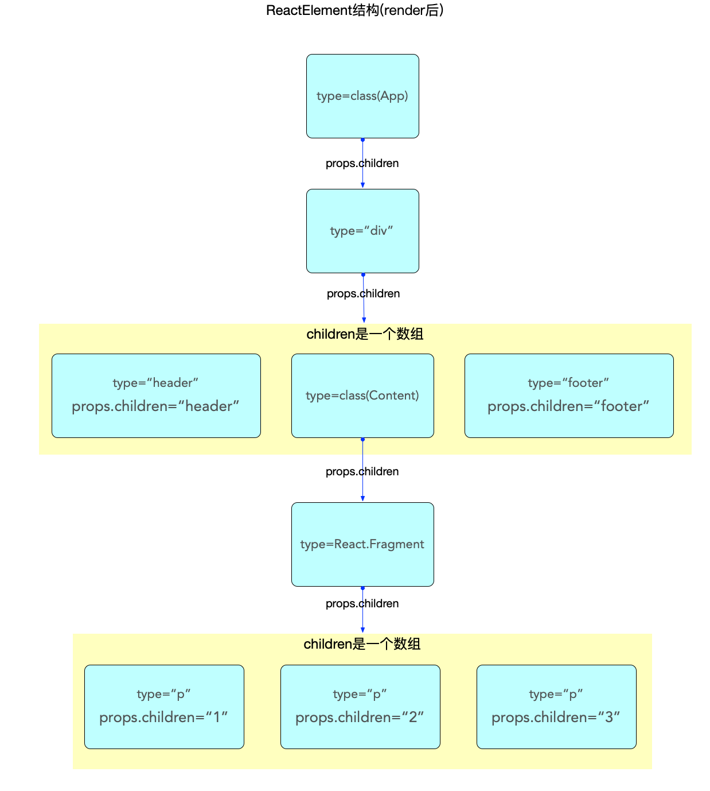
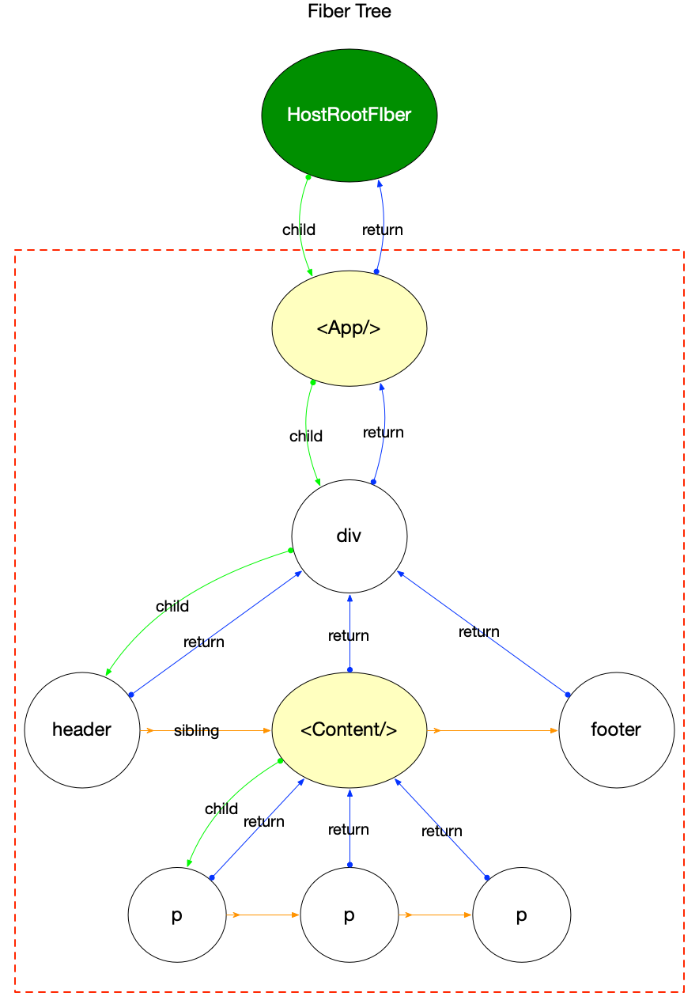
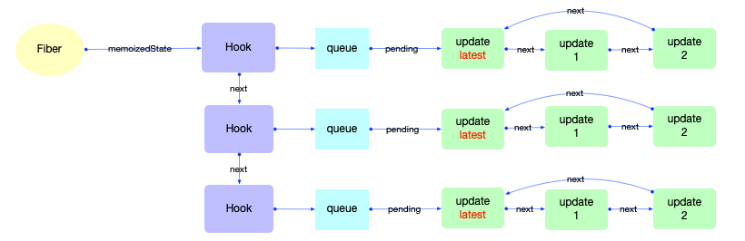

# React 中的常用对象

React 中定义了很多特定的数据结构，了解这些对象对我们理解React 的工作原理很有帮助。

## ReactElement

所有的 `jsx` 语法都会被解析为 `React.createElement` 函数，这个函数的作用就是创建一个 `ReactElement` 对象。

定义如下：

```ts
export type ReactElement = {|
  // 用于辨别ReactElement对象
  $$typeof: any,

  // 内部属性
  type: any, // 表明其种类
  key: any,
  ref: any,
  props: any,

  // ReactFiber 记录创建本对象的Fiber节点, 还未与Fiber树关联之前, 该属性为null
  _owner: any,

  // __DEV__ dev环境下的一些额外信息, 如文件路径, 文件名, 行列信息等
  _store: {validated: boolean, ...},
  _self: React$Element<any>,
  _shadowChildren: any,
  _source: Source,
|};
```

其中有两个需要注意的属性：

1. `key` 属性在 `reconciler` 阶段会用到, 目前只需要知道所有的 `ReactElement` 对象都有 `key` 属性(且其默认值是 `null`, 这点十分重要, 在 diff 算法中会使用到).
2. `type` 属性决定了节点的种类

下面代码的ReactElement对象如下图所示

```jsx
function App() {
    return (
      <div className="app">
        <header>header</header>
        <Content />
        <footer>footer</footer>
      </div>
    );
}

function Content() {
    return (
      <React.Fragment>
        <p>1</p>
        <p>2</p>
        <p>3</p>
      </React.Fragment>
    );
}

export default App;
```



## Fiber

Fiber 是 React 16.0 中引入的一个概念，它用来描述组件的渲染过程，Fiber 的设计思想是把组件渲染的过程分成多个阶段，每个阶段都对应一个 Fiber 对象，Fiber 对象用来描述组件的渲染过程，Fiber 对象的属性如下：

```ts
// 一个Fiber对象代表一个即将渲染或者已经渲染的组件(ReactElement), 一个组件可能对应两个fiber(current和WorkInProgress)
// 单个属性的解释在后文(在注释中无法添加超链接)
export type Fiber = {|
  tag: WorkTag,
  key: null | string,
  elementType: any,
  type: any,
  stateNode: any,
  return: Fiber | null,
  child: Fiber | null,
  sibling: Fiber | null,
  index: number,
  ref:
    | null
    | (((handle: mixed) => void) & { _stringRef: ?string, ... })
    | RefObject,
  pendingProps: any, // 从`ReactElement`对象传入的 props. 用于和`fiber.memoizedProps`比较可以得出属性是否变动
  memoizedProps: any, // 上一次生成子节点时用到的属性, 生成子节点之后保持在内存中
  updateQueue: mixed, // 存储state更新的队列, 当前节点的state改动之后, 都会创建一个update对象添加到这个队列中.
  memoizedState: any, // 用于输出的state, 最终渲染所使用的state
  dependencies: Dependencies | null, // 该fiber节点所依赖的(contexts, events)等
  mode: TypeOfMode, // 二进制位Bitfield,继承至父节点,影响本fiber节点及其子树中所有节点. 与react应用的运行模式有关(有ConcurrentMode, BlockingMode, NoMode等选项).

  // Effect 副作用相关
  flags: Flags, // 标志位
  subtreeFlags: Flags, //替代16.x版本中的 firstEffect, nextEffect. 当设置了 enableNewReconciler=true才会启用
  deletions: Array<Fiber> | null, // 存储将要被删除的子节点. 当设置了 enableNewReconciler=true才会启用

  nextEffect: Fiber | null, // 单向链表, 指向下一个有副作用的fiber节点
  firstEffect: Fiber | null, // 指向副作用链表中的第一个fiber节点
  lastEffect: Fiber | null, // 指向副作用链表中的最后一个fiber节点

  // 优先级相关
  lanes: Lanes, // 本fiber节点的优先级
  childLanes: Lanes, // 子节点的优先级
  alternate: Fiber | null, // 指向内存中的另一个fiber, 每个被更新过fiber节点在内存中都是成对出现(current和workInProgress)

  // 性能统计相关(开启enableProfilerTimer后才会统计)
  // react-dev-tool会根据这些时间统计来评估性能
  actualDuration?: number, // 本次更新过程, 本节点以及子树所消耗的总时间
  actualStartTime?: number, // 标记本fiber节点开始构建的时间
  selfBaseDuration?: number, // 用于最近一次生成本fiber节点所消耗的时间
  treeBaseDuration?: number, // 生成子树所消耗的时间的总和
|};
```

属性解释：

- `fiber.tag`: 表示 `fiber` 类型, 根据 `ReactElement` 组件的 `type` 进行生成, 在 `react` 内部共定义了25 种 `tag`.
- `fiber.key`: 和 `ReactElement` 组件的 `key` 一致.
- `fiber.elementType`: 一般来讲和 `ReactElemen` t组件的 `type` 一致
- `fiber.type`: 一般来讲和 `fiber.elementType` 一致. 一些特殊情形下, 比如在开发环境下为了兼容热更新(HotReloading), 会对 `function`, `class`, `ForwardRef` 类型的 `ReactElement` 做一定的处理, 这种情况会区别于 `fiber.elementType`, 具体赋值关系可以查看源文件.
- `fiber.stateNode`: 与 `fiber` 关联的局部状态节点(比如: `HostComponent` 类型指向与 `fiber` 节点对应的 `dom` 节点; 根节点 `fiber.stateNode` 指向的是 `FiberRoot`; `class` 类型节点其stateNode指向的是 `class` 实例).
- `fiber.return`: 指向父节点.
- `fiber.child`: 指向第一个子节点.
- `fiber.sibling`: 指向下一个兄弟节点.
- `fiber.index`: `fiber` 在兄弟节点中的索引, 如果是单节点默认为 0.
- `fiber.ref`: 指向在 `ReactElement` 组件上设置的 `ref`( `string` 类型的 `ref` 除外, 这种类型的 `ref` 已经不推荐使用, `reconciler` 阶段会将 `string` 类型的 `ref` 转换成一个 `function` 类型).
- `fiber.pendingProps`: 输入属性, 从 `ReactElement` 对象传入的 `props`. 用于和 `fiber.memoizedProps` 比较可以得出属性是否变动.
- `fiber.memoizedProps`: 上一次生成子节点时用到的属性, 生成子节点之后保持在内存中. 向下生成子节点之前叫做 `pendingProps`, 生成子节点之后会把 `pendingProps` 赋值给 `memoizedProps` 用于下一次比较，`pendingProps` 和`memoizedProps` 比较可以得出属性是否变动.
- `fiber.updateQueue`: 存储 `update` 更新对象的队列, 每一次发起更新, 都需要在该队列上创建一个 `update` 对象.
- `fiber.memoizedState`: 上一次生成子节点之后保持在内存中的局部状态.
- `fiber.dependencies`: 该 `fiber` 节点所依赖的( `contexts`, `events` )等, 在 `context` 机制章节详细说明.
- `fiber.mode`: 二进制位 `Bitfield`,继承至父节点,影响本 `fiber` 节点及其子树中所有节点. 与 `react` 应用的运行模式有关(有 `ConcurrentMode`, `BlockingMode`, `NoMode` 等选项).
- `fiber.flags`: 标志位, 副作用标记(在 16.x 版本中叫做 `effectTag`, 相应pr), 在`ReactFiberFlags.js`中定义了所有的标志位. `reconciler`阶段会将所有拥有`flags`标记的节点添加到副作用链表中, 等待 commit 阶段的处理.
- `fiber.subtreeFlags`: 替代 16.x 版本中的 `firstEffect`, `nextEffect`，默认未开启, 当设置了`enableNewReconciler=true` 才会启用, 本系列只跟踪稳定版的代码, 未来版本不会深入解读, 使用示例见源码.
- `fiber.deletions`: 存储将要被删除的子节点. 默认未开启, 当设置了`enableNewReconciler=true` 才会启用, 本系列只跟踪稳定版的代码, 未来版本不会深入解读, 使用示例见源码.
- `fiber.nextEffect`: 单向链表, 指向下一个有副作用的 `fiber` 节点.
- `fiber.firstEffect`: 指向副作用链表中的第一个 `fiber` 节点.
- `fiber.lastEffect`: 指向副作用链表中的最后一个 `fiber` 节点.
- `fiber.lanes`: 本 `fiber` 节点所属的优先级, 创建 `fiber` 的时候设置.
- `fiber.childLanes`: 子节点所属的优先级.
- `fiber.alternate`: 指向内存中的另一个 `fiber`, 每个被更新过 `fiber` 节点在内存中都是成对出现(`current` 和 `workInProgress`)

接下来查看一些代码示例和图片来进一步了解一下

```jsx
function App() {
    return (
      <div className="app">
        <header>header</header>
        <Content />
        <footer>footer</footer>
      </div>
    );
}

function Content() {
    return (
      <React.Fragment>
        <p>1</p>
        <p>2</p>
        <p>3</p>
      </React.Fragment>
    );
}

export default App;
```



## Hook

Hook 用在函数组件中，能够让函数组件拥有状态等价于类组件的功能

```ts
export type Hook = {|
  memoizedState: any, // 内存状态, 用于输出成最终的fiber树
  baseState: any, // 基础状态, 当Hook.queue更新过后, baseState也会更新.
  baseQueue: Update<any, any> | null, // 基础状态队列, 在reconciler阶段会辅助状态合并.
  queue: UpdateQueue<any, any> | null, // 指向一个Update队列
  next: Hook | null, // 指向该function组件的下一个Hook对象, 使得多个Hook之间也构成了一个链表.
|};

type Update<S, A> = {|
  lane: Lane,
  action: A,
  eagerReducer: ((S, A) => S) | null,
  eagerState: S | null,
  next: Update<S, A>,
  priority?: ReactPriorityLevel,
|};

type UpdateQueue<S, A> = {|
  pending: Update<S, A> | null,
  dispatch: ((A) => mixed) | null,
  lastRenderedReducer: ((S, A) => S) | null,
  lastRenderedState: S | null,
|};
```


