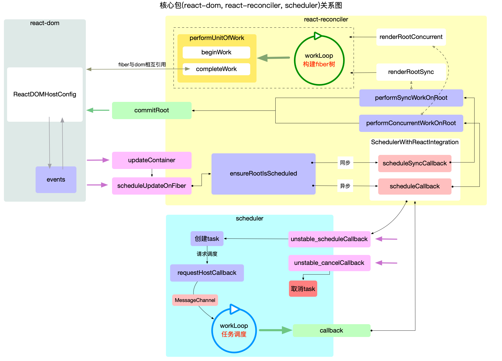

# React结构

## 基础包结构

[学习React自己写的项目](https://github.com/dabanheiji/react-study/tree/feature-v6)

React中基础包分为一下几个包

- `react`：React基础包，只提供定义React组件的必要函数，一般来说要和渲染器一同使用，编写React代码的时候大部分是用的这个包的api
- `react-dom`：React渲染器之一，是React和web平台连接的桥梁，我们使用的入口函数 `ReactDOM.render()` 或者 `ReactDOM.createRoot().render()` 就是这个包提供的函数
- `react-reconciler`：这个包是React运行的核心包，用来协调 `react-dom`, `react`, `scheduler` 等包之间的通信，是React渲染的核心
- `scheduler`：这个包是调度机制的实现，控制由 `react-reconciler` 送入回调函数的执行时机，在编写 `react` 应用的代码时，同样不会调用此包提供的api

## 架构分层

### 接口层

在开发 `React` 应用时，使用的 api 大多来自 `react` 模块，我们改变渲染的基本操作有三个：

1. class 组件的 `setState` 方法
2. 函数组件的 `useState` 方法，底层是 `dispatchAction` 方法
3. 改变 `context` 的值，这个基本上需要结合 1 和 2 中的方法一起使用

### 内核层

#### 调度器

调度器就是 `scheduler` 包，这个包只起到一个作用就是回调，主要是把 `react-reconciler` 提供的回调函数包装到一个任务对象中，在内部维护一个任务队列，按照优先级去回调任务，直到任务队列清空。

#### 构造器

构造器就是 `react-reconciler` 包，接收 `react-dom` 包的初次渲染和 `react` 包中发起的更新请求，将 fiber 树的构造过程包装在一个回调函数中，并将这些回调函数传入 `scheduler` 包中，由调度器去执行。

#### 渲染层

渲染层就是 `react-dom` 包，这个包的主要作用是引导 `react` 应用的启动，以及实现 `HostConfig` 接口，用于 `react-reconciler` 包的调用。

图解

